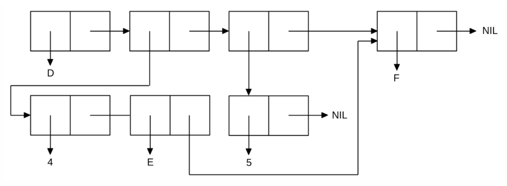

<p align="center"><b>МОНУ НТУУ КПІ ім. Ігоря Сікорського ФПМ СПіСКС</b></p>
<p align="center">
<b>Звіт з лабораторної роботи 1</b><br/>
"Обробка списків з використанням базових функцій"<br/>
дисципліни "Вступ до функціонального програмування"
</p>

<p align="right">Гультяєв Дмитро Антонович<p>
<p align="right">2024<p>
  
## Загальне завдання
```lisp
;; 1) Створення списку згідно умови завдання
CL-USER> (defvar lab-list nil)

(setq lab-list (cons 'A (cons 'B (cons 1 (cons 2 (cons (list 'L 'I 'S 'P) (list nil)))))))
(A B 1 2 (L I S P) NIL)

;; 2) Отримання голову списку
CL-USER> (car lab-list)
A

;; 3) Отримання хвосту списку
CL-USER> (cdr lab-list)
(B 1 2 (L I S P) NIL)

;; 4) Отримання третього елементу списку
CL-USER> (nth 2 lab-list)
1

;; 5) Отримання останнього елементу списку.
CL-USER> (last lab-list)
(NIL)

;; 6.1) Використання предикати atom
CL-USER> (atom (nth 1 lab-list))
T

CL-USER> (atom (nth 4 lab-list))
NIL

CL-USER> (atom (last lab-list))
NIL

;; 6.2) Використання предикати listp
CL-USER> (listp (nth 1 lab-list))
NIL

CL-USER> (listp (nth 4 lab-list))
T

CL-USER> (listp (last lab-list))
T

;; 7) Використання інших предикат
CL-USER> (eql (nth 0 lab-list) 'A)
T

CL-USER> (equal (nth 4 lab-list) (list 'L 'I 'S 'P))
T

CL-USER> (= (nth 2 lab-list) 5)
NIL

;; 8) Об'єднання списків
CL-USER> (append lab-list (nth 4 lab-list))
(A B 1 2 (L I S P) NIL L I S P)
```
## Варіант 5
<p align="center">

</p>

```lisp
CL-USER> 
(defvar list1 nil)
(defvar list2 nil)

(setq list2 '(4 e f) list1 (list 'd list2 (list (list 5) (car (last list2)))))

(D (4 E F) ((5) F))
```
